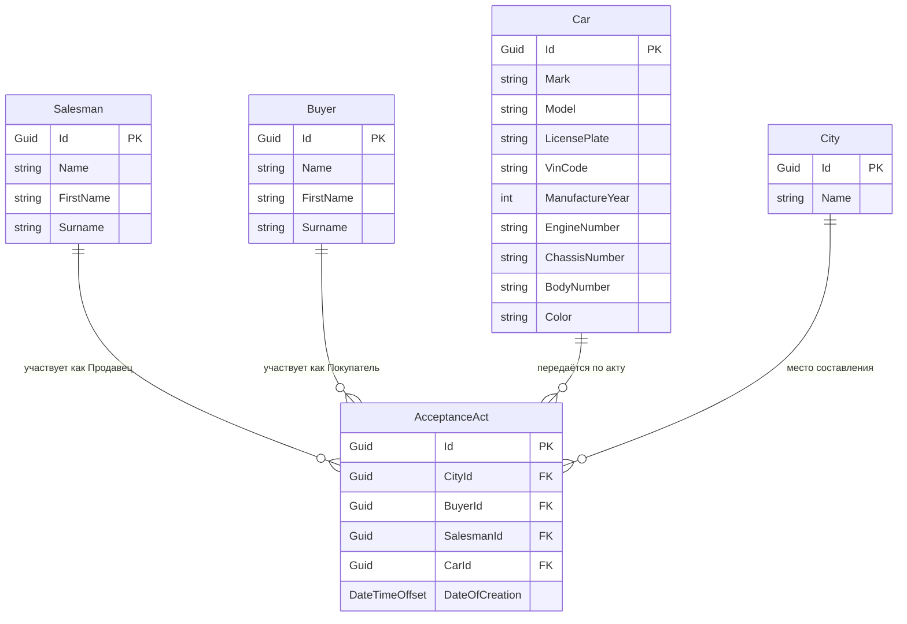

# Гребенюк Игорь Олегович

ИП-24-4

Задание:ASP.NET Core Web API

# Пример акта

# Схема сущностей

```mermaid
erDiagram
    Salesman ||--o{ AcceptanceAct : "участвует как Продавец"
    Buyer    ||--o{ AcceptanceAct : "участвует как Покупатель"
    Car      ||--o{ AcceptanceAct : "передаётся по акту"
    City     ||--o{ AcceptanceAct : "место составления"

    Salesman {
        Guid Id PK
        string Name
        string FirstName
        string Surname
    }

    Buyer {
        Guid Id PK
        string Name
        string FirstName
        string Surname
    }

    Car {
        Guid Id PK
        string Mark
        string Model
        string LicensePlate
        string VinCode
        int ManufactureYear
        string EngineNumber
        string ChassisNumber
        string BodyNumber
        string Color
    }

    City {
        Guid Id PK
        string Name
    }

    AcceptanceAct {
        Guid Id PK
        Guid CityId FK
        Guid BuyerId FK
        Guid SalesmanId FK
        Guid CarId FK
        DateTimeOffset DateOfCreation
    }
```
